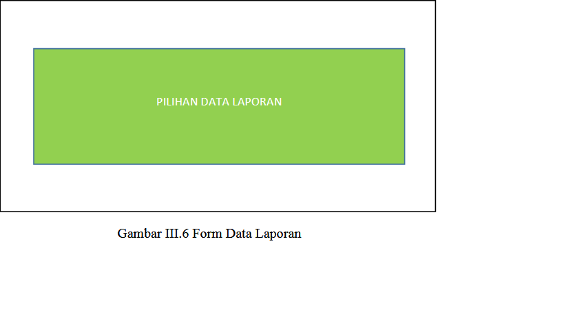

### SOFTWARE DESIGN DOCUMENT
**1.** **PENDAHULUAN**
**1.1** **Tujuan**
	<ol>Tujuan dalam membuat dokumen SDD (Software Design Description) ini adalah untuk menjelaskan  langkah-langkah desain dan proses-proses dalam pembuatan sistem aplikasi yang akan di terapkan pada aplikasi simulasi management proyek RPL dan juga memberi definisi kebutuhan untuk sistem spesifikasi kebutuhan fungsional.</ol>
**1.2** **Ruang Lingkup**
	<ol>Ruang lingkup SDD ini adalah penjelasan mengenai aplikasi simulasi management proyek RPL berbasis dekstop, ruang lingkup system ini mencangkup informasi mengenai antarmuka dari system tersebut. </ol>
**1.3** **Definisi, Akronim, dan Singkatan**
<ol>Dalam penulisan dokumen pembuatan projek ini yang mungkin akan sulit di pahami  berikut ini:  
 Singakatan Arti  
SDD Software Design Description  
OOP Object Oriented Programing  
User  Untuk pengguna system  </ol>

**2** **Referensi**
<ol>a. Modul KULIAH RPL 7 DOKUMEN SDD  
b. Contoh Software Design Document (SDD) Moch. Bambang Sulistio </ol>

***3.*** ***Deskripsi Dekomposisi***   
**3.1** **Dekomposisi Modul**  
<ol>Kebutuhan fungsional (Functional Requirements) ini adalah kebutuhan utama
yang diharapkan dari sistem ini, yang terkait langsung dengan sistem ini.
Kebutuhan fungsional dari sistem ini adalah sebagai berikut:

 1. Pencatatan Hak Akses
 2. Pencatatan Nama aplikasi , Nama Kategori dan Nama Client
 3. Pencatatan Target Waktu , Jumlah Orang dan Biaya Aplikasi

<ol> Spesifikasi yang diharapkan pada Pencatatan Hak Akses:
 Membedakan antara user dan admin dalam hak ases
 Sistem dapat memproses secara otomatis jika kita terdaftar dalam admin
memiliki hak ases penuh dan sebaliknya juka terdaftar dalam user tidak
memiliki hak ases penuh

<ol>Spesifikasi yang diharapkan pada Pencatatan Nama aplikasi, Nama Kategori dan Nama  Client :

 - Mencatat nama aplikasi apa yang akna di buat dalam sebuah project
 - Mencatat nama-nama kategori apa yang akan di buat di sebuah project
 - Mencatat nama client yang mau di buat kan sebuah project

<ol>Spesifikasi yang diharapkan pada Pencatatan Target Waktu , Jumlah Orang dan
Biaya Aplikasi :

 - Sistem dapat memproses secara otomatis target waktu aplikasi yang   
   akan di  buat dalam sebuah project   
 - Sistem dapat memproses secara otomatis jumlah orang dalam sebuah project
 - Sistem dapat memproses secara otomatis biaya dalam sebuah aplikasi yang  akan di buat

**3.2** **Dekomposisi Proses Konkuren**  
<ol>Konkurensi adalah proses-proses (lebih dari satu proses) yang terjadi pada saat
bersamaan. Konkurensi merupakan landasan umum perancangan sistem operasi.
Proses-proses disebut konkuren jika proses-proses berada pada saat yang sama.
Pada proses-proses konkuren yang berinteraksi mempunyai beberapa masalah yang harus diselesaikan: </ol>

 1. List item
 2. Mutual Exclusion
 3. Sinkronisasi
 4. Deadlock
 5. Startvation

<ol>Pada sistem dengan banyak proses (kongkuren), terdapat 2 katagori interaksi,
yaitu:

 - Proses-proses Saling Tidak Peduli (Independen).
Proses-proses ini tidak dimaksudkan untuk bekerja untukmencapai tujuan
tertentu. Pada multiprogramming dengan proses-proses independen, dapat
berupa batch atau sesi interaktif, atau campuran keduanya.
 - Proses-proses Saling Mempedulikan Secara Tidak Langsung.
Proses-proses tidak perlu saling mempedulikan identitas proses-proses lain,
tapi sama-sama mengakses objek tertentu, seperti buffer masukan/keluaran.
Proses-proses itu perlu bekerja sama (cooperation) dalam memakai bersama
objek tertentu.  
 - Proses-proses konkuren mengharuskan beberapa hal yang harus ditangani,
antara lain:
<ol>a. Sistem operasi harus mengetahui proses-proses yang aktif  
b. Sistem operasi harus mengalokasikan dan mendealokasikan beragam
sumber daya untuk tiap proses aktif. Sumber daya yang harus dikelola,
antara lain:  
 - Waktu pemroses. 
 - Memori  
 - Berkas-berkas  
 - Perangkat I/O  
c. Sistem operasi harus memproteksi data dan sumber daya fisik masingmasing proses dari gangguan proses-proses lain.  
d. Hasil-hasil proses harus independen terhadap kecepatan relatif prosesproses lain dimana eksekusi dilakukan.  

**3.3** **Dekomposisi Data**  
<ol>Bagian ini akan menjelaskan struktur data. Table yang terbentuk ada 2 (Dua)
dengan nama masing masing tablenya adalah sebagai berikut :  

 - Tabel karyawan
 -  Tabel hitung_cost
Penjelasan fungsi dari masing masing tabel akan dijelaskan pada bagian berikut
ini :  
Tabel admin, digunakan untuk menyimpan informasi Admin, dimana Admin ini
dapat mengolah sebuah aplikasi dengan penuh seperti meng edit, simpan, hapus dan update</ol>

<table border="1">
    <tr>
        <td>Nama Field</td>
        <td>Tipe</td>
        <td>Keterangan untuk field</td>
    </tr>
    <tr>
        <td>No</td>
        <td>Int(20)</td>
        <td> Untuk menyimpan no urut</td>
    </tr>
    <tr>
        <td> Nama </td>
        <td> Varchar(50)</td>
        <td> Untuk menyimpan Nama dari admin</td>
    </tr>
    <tr>
        <td> Id</td>
        <td> int(50)</td>
        <td> Untuk menyimpan kode admin</td>
    </tr>
    <tr>
        <td> password</td>
        <td> varchar(50)</td>
        <td> Untuk menyimpan password admin</td>
    </tr>
    <tr>
        <td> contact_person</td>
        <td> int(50)</td>
        <td> Nomor telepon yang dapat dihubungi</td>
    </tr>
    <tr>
        <td> Kategori</td>
        <td> varchar(50)</td>
        <td> Untuk menyimpan kategori project</td>
    </tr>
    <tr>
        <td> Kemampuan</td>
        <td> varhar(50)</td>
        <td> Untuk menyimpan kemampuan yang mengerjakan project</td>
    </tr>
    <tr>
        <td> Email</td>
        <td> char(50)</td>
        <td> Untuk menyimpan email admin</td>
    </tr>
    <tr>
        <td> Alamat</td>
        <td> varchar(50)</td>
        <td> Untuk menyimpan alamat admin</td>
    </tr>
    <tr>
        <td> hak_akses</td>
        <td> varchar(50)</td>
        <td> Untuk menyimpan hak akses user atau admin</td>
    </tr>
</table>

<ol>Tabel hitung, digunakan untuk menyimpan hasil efroth, durasi waktu, jumlah orang dan gaji setiap karyawan yang bekerja dalam sebuah project aplikasi.  

 <table border="1">
    <tr>
        <td>Nama Field</td>
        <td>Tipe</td>
        <td>Keterangan untuk field</td>
    </tr>
    <tr>
        <td>No</td>
        <td>Int(20)</td>
        <td> Untuk menyimpan no urut</td>
    </tr>
    <tr>
        <td> nama_aplikasi </td>
        <td> Varchar(50)</td>
        <td> Nama aplikasi apa yang mau dibuat</td>
    </tr>
    <tr>
        <td> Kategori</td>
        <td> varchar(50)</td>
        <td> Untuk menyimpan kategori project</td>
    </tr>
        <tr>
        <td> nama_client</td>
        <td> varchar(50)</td>
        <td> Untuk menyimpan nama client</td>
    </tr>
        <tr>
        <td> Untuk</td>
        <td> varchar(50)</td>
        <td> Untuk menyimpan kearah mana aplikasi ini dibuat</td>
    </tr>
    <tr>
        <td> contact_person</td>
        <td> int(50)</td>
        <td> Nomor telepon yang dapat dihubungi</td>
    </tr>
    <tr>
        <td> Email</td>
        <td> char(50)</td>
        <td> Untuk menyimpan email admin</td>
    </tr>
    <tr>
        <td> Halaman</td>
        <td> int(50)</td>
        <td> Untuk menyimpan nilai halaman</td>
    </tr>
    <tr>
        <td> loc_halaman</td>
        <td> int(50)</td>
        <td> Untuk menyimpan nilai loc halaman</td>
    </tr>
        <tr>
        <td> Komponen</td>
        <td> int(50)</td>
        <td> Untuk menyimpan nilai komponen</td>
    </tr>
     <tr>
        <td> Efroth</td>
        <td> int(50)</td>
        <td> Untuk menyimpan nilai eforth</td>
    </tr>
     <tr>
        <td> loc_total</td>
        <td> int(50)</td>
        <td> Untuk menyimpan nilai loc_total</td>
    </tr>
     <tr>
        <td> target_waktu</td>
        <td> int(50)</td>
        <td> Untuk menyimpan target waktu</td>
    </tr>
     <tr>
        <td> Jumlah</td>
        <td> int(50)</td>
        <td> Untuk menyimpan jumlah orang dalam project </td>
    </tr>
     <tr>
        <td> Cost</td>
        <td> int(50)</td>
        <td> Untuk menyimpan harga sebuah project</td>
    </tr>
</table>

***4.*** ***Deskripsi Ketergatungan/Keterkaitan***  
**4.1** **Keterkaitan inter modul**  
<ol>
    Ketika  merancang  sebuah  Dependensi  Inter-modul  sistem,  dapat  dirancang dengan dua cara yang luas dan cara pertama adalah untuk merancang sistem yang lengkap dengan menggunakan sistem yang ada diketahui dan mengimplementasikan fitur baru  yang diperlukan untuk meningkatkan efektivitas sistem dan mengujinya di kondisi nyata. Cara alternatif akan merancang sistem dan biasanya  karena  biaya  untuk  menyiapkan  antarmuka  antara  modul.  Modul  dari siaran  berita  Sistem  SCC  tergantung  pada  penyebaran  informasi.  Ini  antar-modul dari  penelitian  ini  adalah  tampilan  dari  pengumuman  dan  itu  termasuk  database sistem. Kemudian seluruh informasi yang telah dimasukkan akan disimpan dalam database,  yang  berasal  dari  proses  input  sampai  pengumuman  menampilkanke monitor lain. 
</ol>

**4.2** **Keterkaitan inter proses**  
<ol>
    Proses  yang  dilakukan  oleh  pengguna  dalam  melakukan  pemesanan  proyek aplikasi akan mempengaruhi beberapa proses lainya seperti penentuan value, dan penjadwalan. Juga data akan tersimpan sebagai riwayat proses pemesanan. 
</ol>

**4.3** **Keterkaitan data**  
<ol>
    Dependensi  data  didasarkan  pada  pengguna.  Mereka  adalah  orang  yang  akan memverifikasi atau menyetujui pengumuman antri. 
</ol>

**5.** **Deskripsi Antar Muka**  
**5.1** **Deskripsi Antarmuka Pengguna**  
<ol>
    Antarmuka  pengguna  (user  interface)  merupakan  bentuk  tampilan  grafis  yang berhubungan  langsung  dengan  pengguna  (user).  Antarmuka  pengguna  berfungsi untuk  menghubungkan  antar  pengguna  dengan  sistem,  sehingga  sistem  tersebut bisa digunakan.  Berikut merupakanrangcangan desain antarmuka pengguna proyek kami. 
<html>
<head>
</head>
<body>
    
</body>
</html>
    Antarmuka ini digunakan untuk melakukan proses login guna mendapatkan hak akses  ke aplikasi. Untuk mendapat akses masuk ke dalam sistem, user harus menginputkan user name dan password dengan benar pada textbox  yang telah disediakan  .   kemudian  sistem  akan  mengecek  user  name  dan  password  yang dimasukkan dengan data user name dan password yang telah tersimpan di dalam sistem. Jika datauser name dan password cocok maka pengguna akan diberikan akses masuk ke dalam sistem, sebaliknya jika user name dan password salah atau tidak cocok maka akan ada pesan peringatan dari aplikasi. 
<html>
<head>
</head>
<body>
    
</body>
</html>
    Antarmuka ini merupakan antarmuka utama yang berisi menu untuk masuk ke   antarmuka-antarmuka   yang   lain.   User   dapat   meilih   fungsionalitas-fungsionalitas  yang  ditawarkan  oleh  aplikasi.  Fungsionalitas yang  ditawarkan seperti pembuatan proyek, info karyawan, dan perhitungan cost. 
<html>
<head>
</head>
<body>
    
</body>
</html>
    Antarmuka ini digunakan untuk membuat proyek perhitungan yang di inginkan. Untuk membuat proyek user harus mengisi form yang telah disediakan, kemudian meng-click hitung. Dan kemudian user diharuskan meng-click save yang berada di pojok kanan atas. Secara otomatis proyek akan disimpan. <!DOCTYPE html>
<html>
<head>
</head>
<body>
    
</body>
</html>
    Antarmuka  ini  digunakan  untuk  melihat  data  para  Karyawan,  caranya    adalah tinggal  memasukkan  ID  Karyawan  yang  ingin  dilihat.  Kemudian  secara  otomatis data akan keluar. 
<html>
<head>
</head>
<body>
    
</body>
</html>
    Antarmuka ini digunakan untuk melihat data dari keseluruhan transaksi pesanan proyek yang pernah ada. 
<html>
<head>
</head>
<body>
    
</body>
</html>
    Antarmuka ini digunakan untuk melihat data dari keseluruhan transaksi pesanan proyek yang pernah ada.  
<html>
<head>
</head>
<body>
    
</body>
</html>
    Antarmuka  ini  digunakan  untuk  melihat  dokumen-dokumen  yang  ditunjukan dalam pembangunan SimulasiManajemen Proyek RPL. <!DOCTYPE html>
<html>
<head>
</head>
<body>
    
</body>
</html>
    Antarmuka  ini  digunakan  untuk  melihat  data  atau  informasi  dari  anggota kelompok tim 2proyek RPL. 
</ol>
**6. Desain Rinci**
6.1 Desain Rinci modul
&emp;&emp;A. Modul Admin pada Web
&emp;&emp;A. Modul Karyawan pada Android
&emp;&emp;A. Modul Pemilik pada Android
